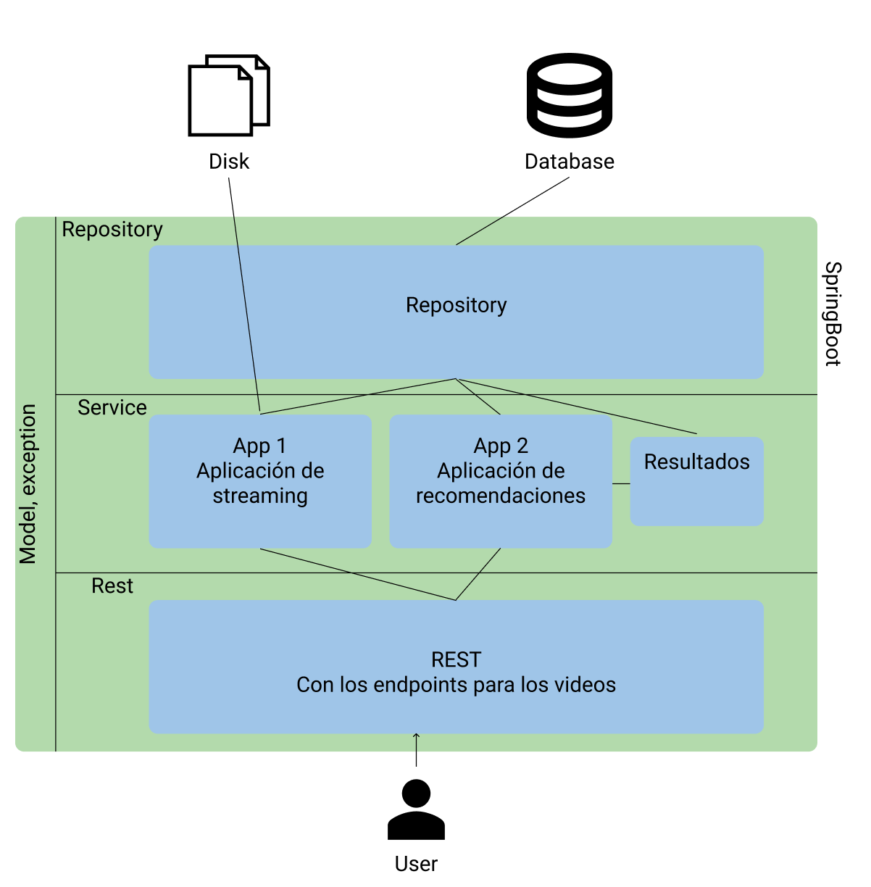

# VideoCloud

## Autores:
- Diego Avila Morales
- Manuel Martin Rico
- Miguel Ángel Quiñones Ramírez
- Carlos Alejandro Pool Quintal

## Documento de Arquitectura de Software

## Índice
- [VideoCloud](#videocloud)
  - [Autores:](#autores)
  - [Documento de Arquitectura de Software](#documento-de-arquitectura-de-software)
  - [Índice](#índice)
  - [Introducción](#introducción)
    - [Propósito](#propósito)
    - [Alcance](#alcance)
    - [Documentos de referencia](#documentos-de-referencia)
  - [Arquitectura](#arquitectura)
    - [Descripción de la arquitectura utilizada (Capas)](#descripción-de-la-arquitectura-utilizada-capas)
    - [Definición teórica de Microservicios](#definición-teórica-de-microservicios)
    - [Diagrama de arquitectura con descripción](#diagrama-de-arquitectura-con-descripción)
    - [Diagrama de secuencia para los procesos descritos en la descripción de la App 1 y la App 2](#diagrama-de-secuencia-para-los-procesos-descritos-en-la-descripción-de-la-app-1-y-la-app-2)
    - [Diagrama de la base de datos](#diagrama-de-la-base-de-datos)
    - [Descripción de las entidades](#descripción-de-las-entidades)
    - [Diagrama entidad-relación](#diagrama-entidad-relación)
  - [Documentación de la API](#documentación-de-la-api)
  - [Criterios de calidad](#criterios-de-calidad)

---

## Introducción

### Propósito

El documento de arquitectura tiene como finalidad proveer una descripción comprensible de la arquitectura del proyecto SongCloud. Se presentan un conjunto de arquitecturas basadas en capas y componentes que muestran diferentes aspectos del sistema, también se enfoca en recopilar las decisiones arquitecturales que se han definido en este proyecto.

### Alcance

El documento de arquitectura contendrá todos los componentes arquitectónicos a usarse en el proyecto SongCloud. Se pretende proveer una fuente de referencia para todos los involucrados en el proyecto. El contenido de este documento es de carácter técnico-informativo, de uso exclusivo de la empresa y/o cliente.

El contenido aquí presentado solamente será accedido y modificado bajo los lineamientos establecidos por el equipo de trabajo.

### Documentos de referencia

- IEEE Recommended Practice for Software Design Descriptions, Software Engineering Standards Committee of the IEEE Computer Society, September, 1998. http://cs.bilkent.edu.tr/~cagatay/cs413/1016-1998_00741934.pdf  
- What are microservices? (s. f.). microservices.io. Recuperado 17 de noviembre de 2020, de https://microservices.io/
- ¿Qué son los microservicios? (s. f.). Redhat. Recuperado 17 de noviembre de 2020, de https://www.redhat.com/es/topics/microservices/what-are-microservices

https://www.javatpoint.com/spring-boot-architecture

https://www.researchgate.net/figure/ADVANTAGES-and-DRAWBACKS-of-LAYERED-APPROACH_tbl1_291075332

---

## Arquitectura

### Descripción de la arquitectura utilizada (Capas)

Para el desarrollo de este proyecto se sigue una arquitectura basada en capas, esto para aprovechar que el framework(SpringBoot) que utilizamos ya la soporta y además encaja dentro de las necesidades del proyecto que se desarrolla.

Las capas que esta arquitectura presenta son las siguientes:
  - Rest : Capa encargada de cuestiones como la autentificación y la conversión de los JSON que reciba de la capa de abajo
  
  &#8595;
  - Service: Capa encargada de la lógica del programa, validaciones y autorizaciones. En esta capa se inlcuiran los microservicios como el módulo para hacer streaming y el módulo para las recomendaciones de los videos

  &#8595;
  - Repository: Capa encargada de crear las conexiones hacia las herramientas de persistencia con las |que se cuente, dicho de otras palabras, la capa que se conecta a la base de datos.

Así pues, contará con un modelo que será el que ayude para la parte de JPA. Y finalmente, debido a que este enfoque la construcción de un sistema robusto, se tendrá un apartado de excepciones a lo largo de todas las capas, esto para poder lanzar las excepciones correspondientes desde el momento que alguna capa no responda apropiadamente.

Siguiendo con las partes involucradas en la arquitectura de este proyecto, los usuarios serán quienes tendrán contacto con el sistema através de la capa REST. Ahora bien, en el lado de la persistencia de los datos, la base de datos sólo tendrá interacciones mediante la capa repository.

### Definición teórica de Microservicios

Los microservicios se tratan de un estilo arquitectónico mediante el cual una aplicación se estructura en función a una colección de **servicios** que deben ser:
* Altamente mantenibles y probables
* Débilmente acoplados
* Independientes en su despliegue
* Organizados de acuerdo a las capacidades de la empresa
* Liderados por un equipo de desarrollo pequeño

Esto quiere decir que permite un despliegue rápido, frecuente y confiable de aplicaciones grandes y complejas. Es un elemento fundamental de la optimización del desarrollo de aplicaciones hacia un modelo nativo de la **nube**.

Cada función se denomina servicio y se puede diseñar e implementar de forma independiente. Es más, desarrollar utilizando este estilo arquitectónico provee beneficios como:
* Aplicaciones más rápidas para comercializarse
* Gran capacidad de expansión
* Capacidad de recuperación 
* Facilidad de implementación
* Accesibilidad para los desarrolladores
* Aplicaciones más abiertas

### Diagrama de arquitectura con descripción

### Diagrama de secuencia para los procesos descritos en la descripción de la App 1 y la App 2

> Diagrama de secuencias

### Diagrama de la base de datos

### Descripción de las entidades

Para una descripción más precisa de las entidades involucradas en la base de datos, se anexa a continuación el siguiente documento de [diseño de la base de datos](https://docs.google.com/document/d/1nUIwVgMMC-rgfiYJIb37Z4NiLlI71eAl7fttU49Pfq0/edit?usp=sharing)

### Diagrama entidad-relación

---

## Documentación de la API

> Aquí metemos un buen y rico POSTMAN (Si es posible)

---

## Criterios de calidad

> Para los criterios de calidad de acuerdo a la ISO/IEC

- Funcionalidad
- Mantenibilidad
- Eficiencia
- Usabilidad
- Confiabilidad